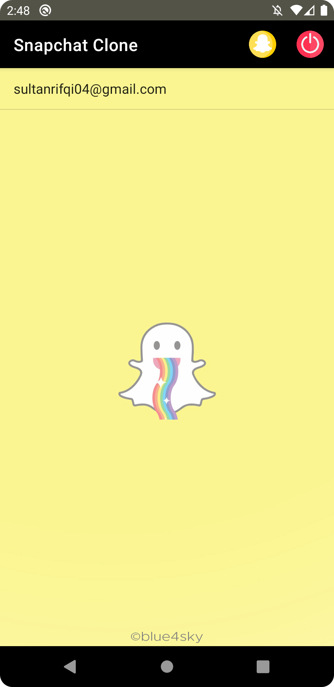
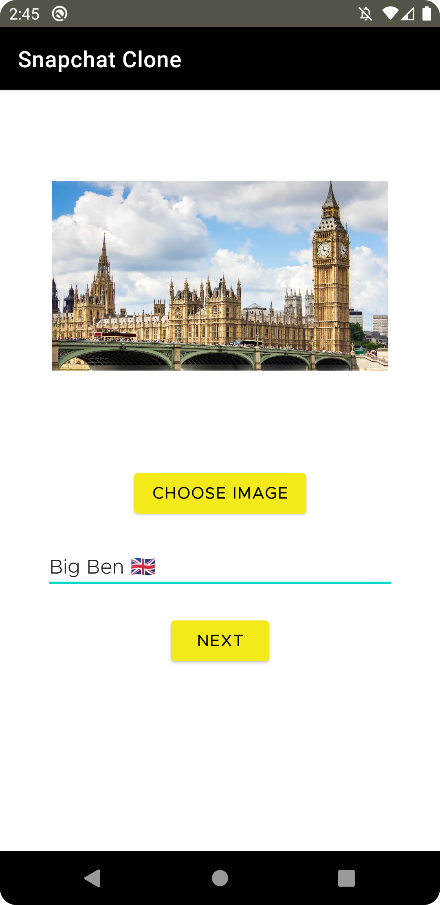
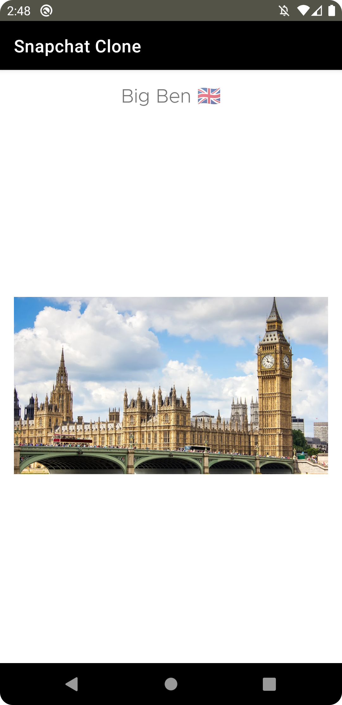

# Snapchat Clone Android App

This app allows users to send a text with a photo to another user, 
just like the original Snapchat App. The message will be stored in the Realtime Database.
Another feature which is similar to the original one is the message 
will be deleted after the user sees it. 
Firebase Authentication is used to store the user's username and password.

## Technologies used
- Kotlin
- XML
- Android Studio
- Firebase

## Screenshots

#### This is the Login page. User can put their registered email address and password, then tap the Login button.

#### This is the main page of the app. All new messages will be shown here. There are two buttons on the top-right corner. The yellow one is for making a new message. The red one is for Log out button.

#### When the user wants to make a new message, this page will be shown. The "Choose Image" button will let the user choose a photo from their phone and the user can also add text below the button. After that, the user just needs to tap the "Next" button.

#### After tapping the "Next" button, this page will be shown. It will list all users that registered in this app. The user needs to choose one username from the list and the message will automatically be sent.

#### This is the page when the user views a new message. After the user presses the back button, this message will automatically be deleted.

## Download Link
[Give it a try! 👻](https://www.mediafire.com/file/6hpr92zhiyg42b0/Snapchat_Clone.apk/file)
